# Informações do Projeto
`TÍTULO DO PROJETO`  

Gastos desnecessários com combustíveis por não conhecer os postos locais

`CURSO` 

Ciência da Computaçao - PUC Coreu

## Participantes
> Os membros do grupo são: 
> - Ana Fernanda Souza Cancado
> - Gabriel Rangel Gontijo
> - João Marcos Nascimento de Freitas
> - Rafael Lima Yasumoto Correa

# Estrutura do Documento

- [Informações do Projeto](#informações-do-projeto)
  - [Participantes](#participantes)
- [Estrutura do Documento](#estrutura-do-documento)
- [Introdução](#introdução)
  - [Problema](#problema)
  - [Objetivos](#objetivos)
  - [Justificativa](#justificativa)
  - [Público-Alvo](#público-alvo)
- [Especificações do Projeto](#especificações-do-projeto)
  - [Personas, Empatia e Proposta de Valor](#personas-empatia-e-proposta-de-valor)
  - [Histórias de Usuários](#histórias-de-usuários)
  - [Requisitos](#requisitos)
    - [Requisitos Funcionais](#requisitos-funcionais)
    - [Requisitos não Funcionais](#requisitos-não-funcionais)
  - [Restrições](#restrições)
- [Projeto de Interface](#projeto-de-interface)
  - [User Flow](#user-flow)
  - [Wireframes](#wireframes)
- [Metodologia](#metodologia)
  - [Divisão de Papéis](#divisão-de-papéis)
  - [Ferramentas](#ferramentas)
  - [Controle de Versão](#controle-de-versão)
- [**############## SPRINT 1 ACABA AQUI #############**](#-sprint-1-acaba-aqui-)
- [Projeto da Solução](#projeto-da-solução)
  - [Tecnologias Utilizadas](#tecnologias-utilizadas)
  - [Arquitetura da solução](#arquitetura-da-solução)
- [Avaliação da Aplicação](#avaliação-da-aplicação)
  - [Plano de Testes](#plano-de-testes)
  - [Ferramentas de Testes (Opcional)](#ferramentas-de-testes-opcional)
  - [Registros de Testes](#registros-de-testes)
- [Referências](#referências)

# Introdução

## Problema

Com a verticalização e urbanização das cidades, torna-se cada vez mais necessário possuir um veículo. Com isso, o número de carros no país, principalmente na região sudeste, está crescendo cada vez mais. Segundo o G1, em 2020, mais de 50% dos brasileiros possuiam um carro na garagem para uso pessoal. 

Em paralelo, tem-se observado diversos reajustes no preço da gasolina durante o ano. Esse aumento de gastos direcionados a essa tarefa imprescindível pode causar problemas financeiros em uma grande parcela da população.

Diante disso, torna-se fundamental que existam canais que ajudem o usuário a econominar durante o abastecimento de seu veículo, permitindo acesso aos preços atualizados de cada posto de combustível. 

## Objetivos

O objetivo geral deste trabalho é desenvolver um software que apresente ferramentas de fácil uso e que permita o acesso aos preços dos combustíveis por postos e informe qual está mais vantajoso para cada situação (entre álcool e gasolina). Além de possuir um pequeno portal de notícias acerca desse tema.  

Como objetivos específicos, podemos ressaltar:
- Fornecer funcionalidades que permitam a visualização dos postos próximos a localização do usuário;
- Permitir que o usuário realize a atualização dos preços;
- Possuir uma ferramenta de busca de postos de combustíveis por endereço ou nome;
- Permitir a visualização dos postos que diveram a maior redução do preço durante certo período;

## Justificativa

Nas entrevistas realizadas, foi constatado que as pessoas que possuem veículos de uso próprio direcionam boa parte de sua renda mensal para o abastecimento de seus veículos. Além disso, já todas elas já abasteceram em um posto e pouco tempo depois passaram em frente a outro estabeleecimento que ofertava o mesmo combustível por um preço menor.

Adicionalmente, há uma falta de conhecimento da população acerca de estabelecer qual o combustível mais vantajoso (entre gasolina e álcool).

## Público-Alvo

Embora diversas pessoas possam se beneficiar de soluções que visem diminuir os gastos direcionados ao abastecimento do veículo, o foco deste trabalho está no público que tem o hábito dirigir um carro pessoal diariamente.

Desta forma, estabeleceu-se como público-alvo desta solução os homens e as mulheres entre 25 a 50 anos que se possuem um trajeto cotidiano, abastecem o carro pelo menos 2 vezes ao mês, fazendo com que seja um gasto representativo entre as despesas. E que fazem uso frequente de computadores e dispositivos móveis para se atualizarem com tópicos que vão além dos assuntos relacionados às suas atividades profissionais.

 
# Especificações do Projeto

A definição exata do problema a ser solucionado e as partes mais importantes a serem tratadas neste projeto foi consolidada com a participação dos usuários em um trabalho de imersão feita pelos membros da equipe por meio de entrevistas. Os detalhes levantados nesse processo foram consolidados na forma de personas e histórias de usuários

## Personas, Empatia e Proposta de Valor

As personas levantadas durante o processo de entendimento do problema são apresentadas na Figuras que se seguem.

> 
> **Persona 1 (José)**
> 
> 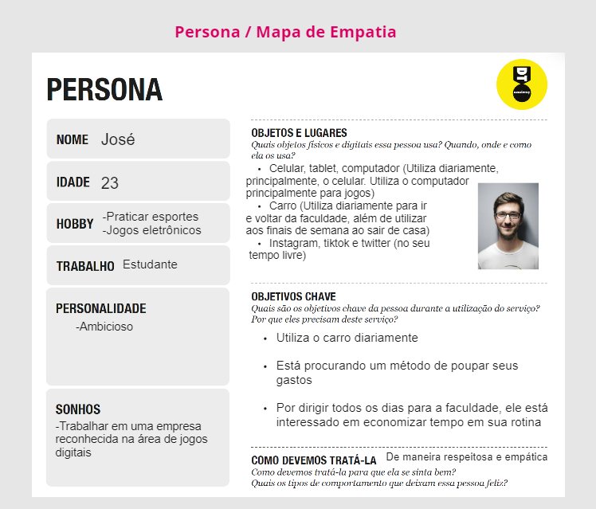
> 
>
> **Proposta de valor José**
> 
> 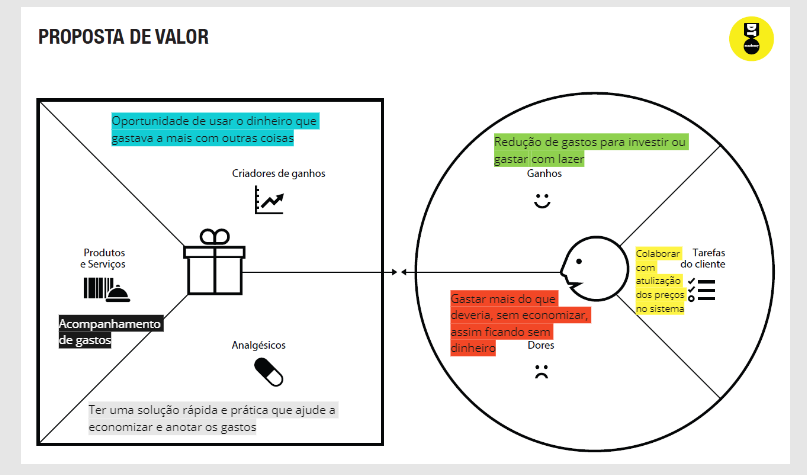
> 
> 
> **Persona 2 (Susana)**
> 
> 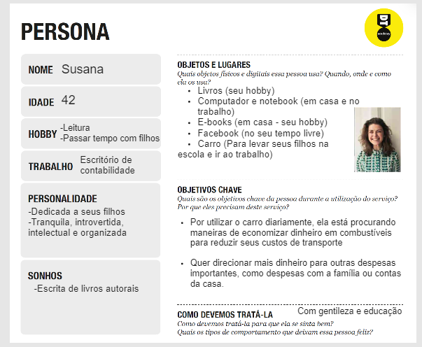
> 
>
> **Proposta de valor Susana**
> 
> 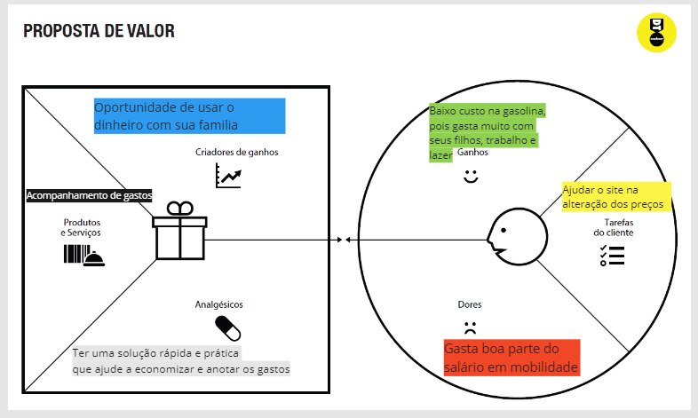
> 

## Histórias de Usuários

Com base na análise das personas forma identificadas as seguintes histórias de usuários:

|EU COMO... `PERSONA`| QUERO/PRECISO ... `FUNCIONALIDADE` |PARA ... `MOTIVO/VALOR`                 |
|--------------------|------------------------------------|----------------------------------------|
|José |Diminuir meus gastos com o meu carro           | Sobrar dinheiro para outras coisas               |
|Susana       | Encontrar postos mais baratos                | Economizar dinheiro |
|Márcio      | Ler mais acerca das notícias relacionadas aos combustíveis                | Me manter informado |
|Airton      | Ter acesso a um mapa que me informe postos ao meu redor               | Descobrir o caminho ideal |
|Susana       | Descobrir qual combustível é mais vantajoso                | Gastar menos |
|José | Ter acesso ao meu histórico de gastos com combustíveis | Controlar as despesas mensais               |
|Márcio      | Gastar menos com combustíveis              | Investir o seu dinheiro |
|Airton      | Saber o preço de determiado posto com antecedência             | Se programar melhor |
|José | Ter acesso aos postos que tiveram uma maior redução nos preços | Frequentar mais eles               |
|Susana | Diminuir minhas despesas | Direcionar minha renda em outras áreas da vida               |

## Requisitos

As tabelas que se seguem apresentam os requisitos funcionais e não funcionais que detalham o escopo do projeto.

### Requisitos Funcionais

|ID    | Descrição do Requisito  | Prioridade |
|------|-----------------------------------------|----|
|RF-001| Permitir que o usuário atualize o preço dos postos | ALTA | 
|RF-002| Permitir a busca de postos por endereço   | MÉDIA |
|RF-003| Permitir que o usuário navegue pelo mapa  | ALTA | 
|RF-004| Emitir um aviso informando qual combustível está mais vantajoso   | MÉDIA |
|RF-005| Ter acesso à localização atualizada do usuário   | ALTA |
|RF-006| O site deve apresentar algumas notícias acerca do tema, obtidas por meio de canais de notícias da Internet | MÉDIA |
|RF-007| O site deve apresentar os "postos em destaque", aqueles que tiveram uma maior reduçao de preço | MÉDIA |
|RF-008| O site deve permitir que o usuário procure os postos por cidade | MÉDIA |

### Requisitos não Funcionais

|ID     | Descrição do Requisito  |Prioridade |
|-------|-------------------------|----|
|RNF-001| O sistema deve ser responsivo para rodar em um dispositivos móvel | MÉDIA | 
|RNF-002| Deve processar requisições do usuário em no máximo 3s |  BAIXA | 
|RNF-003| O sistema deve garantir a privacidade dos dados do usuário | MÉDIA | 
|RNF-004| O site deve ter bom nível de contraste entre os elementos da tela em conformidade | MÉDIA | 
|RNF-005| O site deve ser compatível com os principais navegadores do mercado (Google Chrome, Firefox, Microsoft Edge) | MÉDIA | 

## Restrições

O projeto está restrito pelos itens apresentados na tabela a seguir.

|ID| Restrição                                             |
|--|-------------------------------------------------------|
|01| O projeto deverá ser entregue até o final do semestre |
|02| Não pode ser desenvolvido um módulo de backend        |
|03| O projeto terá que ser implantado em apenas uma região|      |

# Projeto de Interface

Dentre as preocupações para a montagem da interface do sistema, estamos estabelecendo foco em questões como usabilidade e praticidade. Desta forma, o projeto tem uma identidade visual simples em todas as telas que são projetadas para funcionamento em desktops e dispositivos móveis.

> Apresente as principais interfaces da solução. Discuta como 
> foram elaboradas de forma a atender os requisitos funcionais, não
> funcionais e histórias de usuário abordados nas [Especificações do
> Projeto](#especificações-do-projeto).

## User Flow

......  INCLUA AQUI O DIAGRAMA COM O FLUXO DO USUÁRIO NA APLICAÇÃO ......

> Fluxo de usuário (User Flow) é uma técnica que permite ao desenvolvedor
> mapear todo fluxo de telas do site ou app. Essa técnica funciona
> para alinhar os caminhos e as possíveis ações que o usuário pode
> fazer junto com os membros de sua equipe.
>
> **Links Úteis**:
> - [User Flow: O Quê É e Como Fazer?](https://medium.com/7bits/fluxo-de-usu%C3%A1rio-user-flow-o-que-%C3%A9-como-fazer-79d965872534)
> - [User Flow vs Site Maps](http://designr.com.br/sitemap-e-user-flow-quais-as-diferencas-e-quando-usar-cada-um/)
> - [Top 25 User Flow Tools & Templates for Smooth](https://www.mockplus.com/blog/post/user-flow-tools)
>
> **Exemplo**:
> 
> 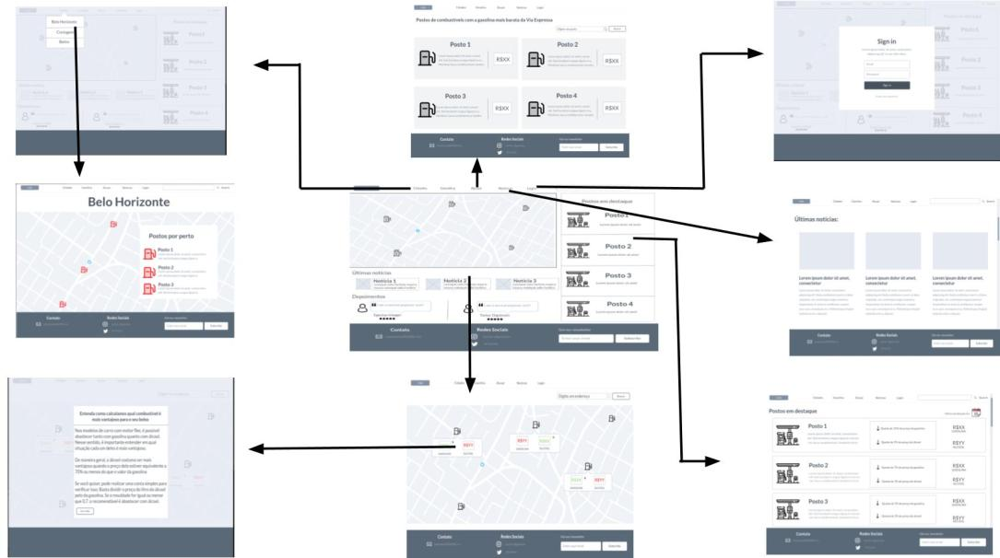

## Wireframes

Conforme fluxo de telas do projeto, apresentado no item anterior, as telas do sistema são apresentadas em detalhes nos itens que se seguem.
> 
> **Tela - Home-Page**:
> 
> A tela de home-page mostra um mapa com a localização no usuário, algumas notícias relevantes para o tema e depoimentos de usuários. Além de contar com postos em destaques na leteral direita. 
> 
> 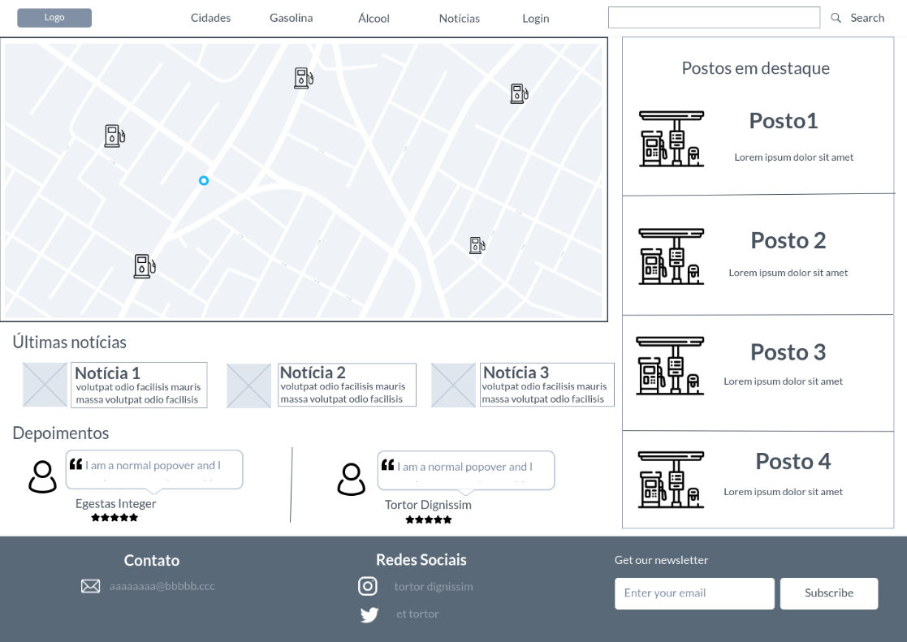
> 
> **Tela - mapa-geral**:
> 
> A tela de mapa-geral mostra um mapa com todos os postos ao redor do usuário e seus respostivos preços de gasolina e álcool. Além de indicar qual dos dois combustível é mais vantajoso para o usuário. 
>
>
> 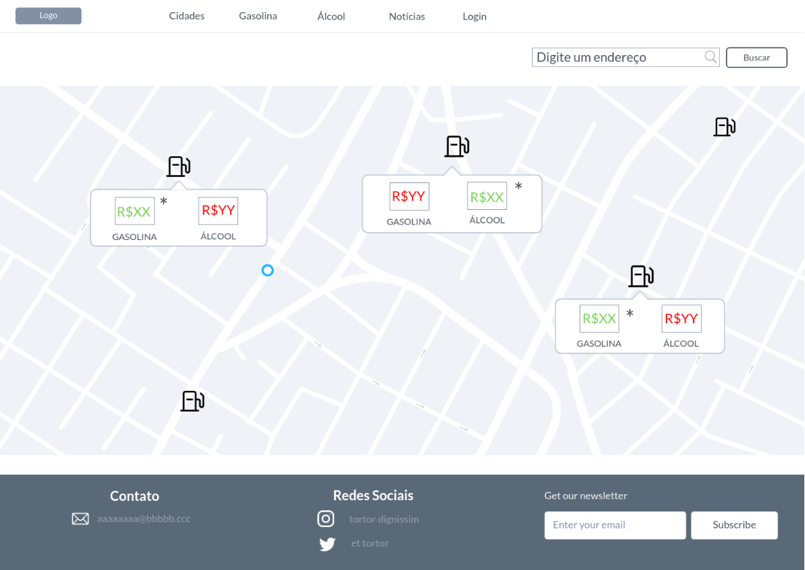
>
> **Tela - postos-destaque**:
> 
> A tela de postos em destaque mostra a relação dos postos que tiveram uma maior redução nos preços dos combustíveis em determinado período de tempo. 
> 
> 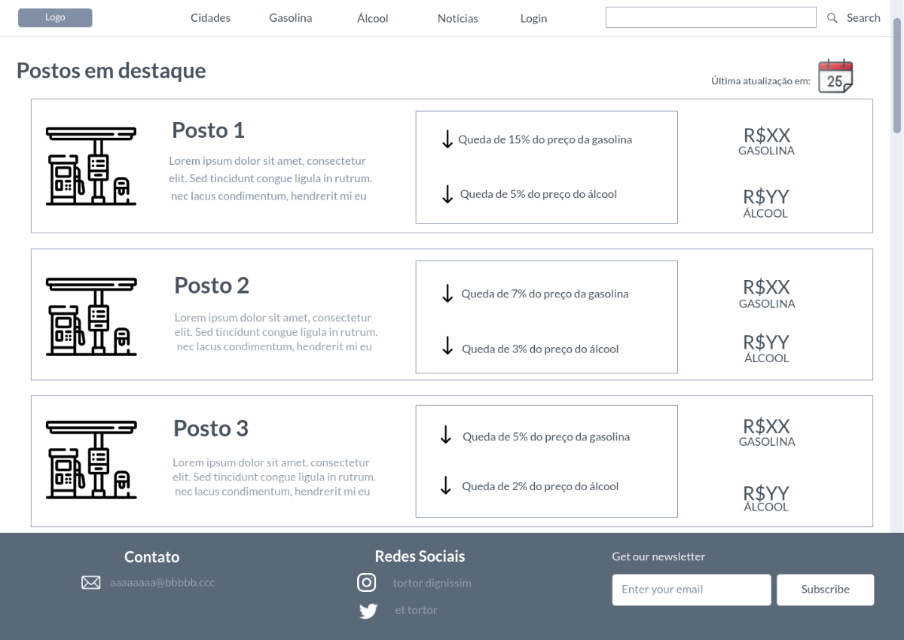
> 
> **Tela - cidades**:
> 
> A tela de cidades permite a visualização dos postos por essa delimitação territorial. Como a região escolhida do projeto foi a Via Expressa, é permitido navegar entre os postos de Belo Horizonte, Contagem e Betim. 
> 
> 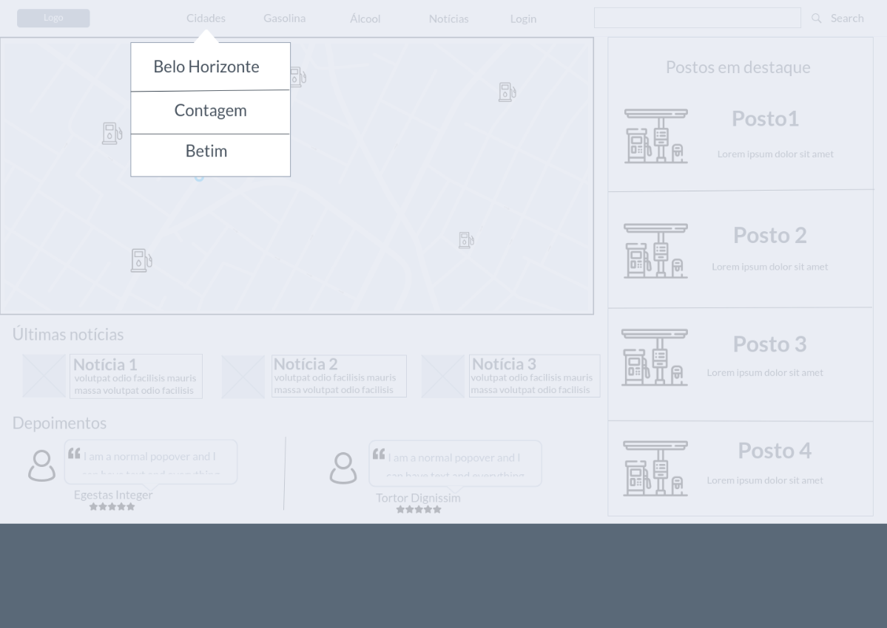
>
>
> 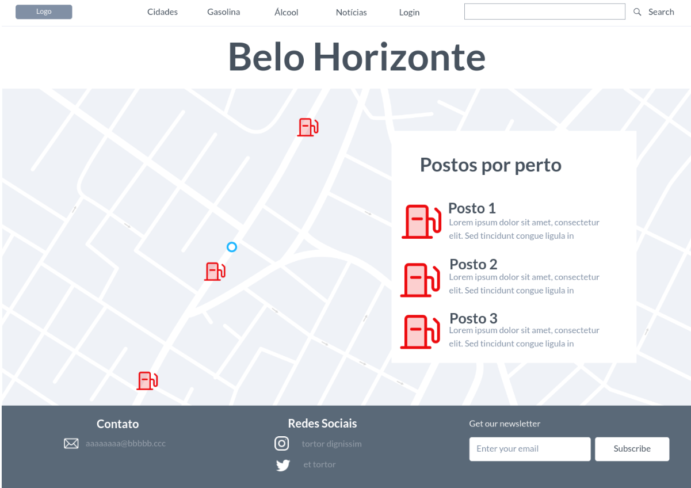
> 
> **Tela - gasolina/álcool**:
> 
> A tela de gasolina permite a visualização da relação dos postos ordenados de maneira crescente acerda do preço desse combustível.
> 
> 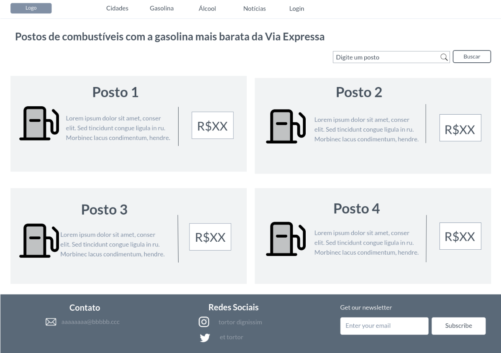
> 
> **Tela - notícias**:
> 
> A tela de notícias permite a visualização das principais noticias que afetam a alteração dos preço dos combustíveis.
> 
> 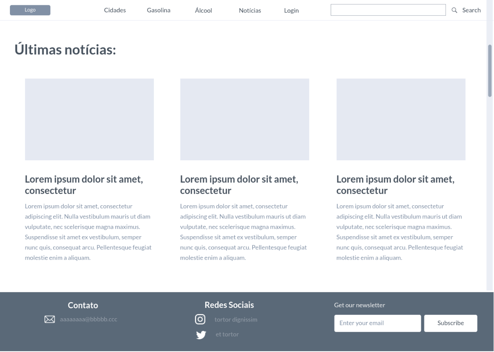

# Metodologia

......  COLOQUE AQUI O SEU TEXTO ......

> Nesta parte do documento, você deve apresentar a metodologia 
> adotada pelo grupo, descrevendo o processo de trabalho baseado nas metodologias ágeis, 
> a divisão de papéis e tarefas, as ferramentas empregadas e como foi realizada a
> gestão de configuração do projeto via GitHub.
>
> Coloque detalhes sobre o processo de Design Thinking e a implementação do Framework Scrum seguido
> pelo grupo. O grupo poderá fazer uso de ferramentas on-line para acompanhar
> o andamento do projeto, a execução das tarefas e o status de desenvolvimento
> da solução.
> 
> **Links Úteis**:
> - [Tutorial Trello](https://trello.com/b/8AygzjUA/tutorial-trello)
> - [Gestão ágil de projetos com o Trello](https://www.youtube.com/watch?v=1o9BOMAKBRE)
> - [Gerência de projetos - Trello com Scrum](https://www.youtube.com/watch?v=DHLA8X_ujwo)
> - [Tutorial Slack](https://slack.com/intl/en-br/)

## Divisão de Papéis

......  COLOQUE AQUI O SEU TEXTO ......

> Apresente a divisão de papéis e tarefas entre os membros do grupo.
>
> **Links Úteis**:
> - [11 Passos Essenciais para Implantar Scrum no seu Projeto](https://mindmaster.com.br/scrum-11-passos/)
> - [Scrum em 9 minutos](https://www.youtube.com/watch?v=XfvQWnRgxG0)

## Ferramentas

......  COLOQUE AQUI O SEU TEXTO - SIGA O EXEMPLO DA TABELA ABAIXO  ......

| Ambiente  | Plataforma              |Link de Acesso |
|-----------|-------------------------|---------------|
|Processo de Design Thinkgin  | Miro |  https://miro.com/XXXXXXX | 
|Repositório de código | GitHub | https://github.com/XXXXXXX | 
|Hospedagem do site | Heroku |  https://XXXXXXX.herokuapp.com | 
|Protótipo Interativo | MavelApp ou Figma | https://figma.com/XXXXXXX | 

>
> Liste as ferramentas empregadas no desenvolvimento do
> projeto, justificando a escolha delas, sempre que possível.
> 
> As ferramentas empregadas no projeto são:
> 
> - Editor de código.
> - Ferramentas de comunicação
> - Ferramentas de diagramação
> - Plataforma de hospedagem
> 
> O editor de código foi escolhido porque ele possui uma integração com o
> sistema de versão. As ferramentas de comunicação utilizadas possuem
> integração semelhante e por isso foram selecionadas. Por fim, para criar
> diagramas utilizamos essa ferramenta por melhor captar as
> necessidades da nossa solução.
> 
> **Links Úteis - Hospedagem**:
> - [Getting Started with Heroku](https://devcenter.heroku.com/start)
> - [Crie seu Site com o HostGator](https://www.hostgator.com.br/como-publicar-seu-site)
> - [GoDady](https://br.godaddy.com/how-to)
> - [GitHub Pages](https://pages.github.com/)

## Controle de Versão

......  COLOQUE AQUI O SEU TEXTO ......

> Discuta como a configuração do projeto foi feita na ferramenta de
> versionamento escolhida. Exponha como a gerência de tags, merges,
> commits e branchs é realizada. Discuta como a gerência de issues foi
> realizada.
> A ferramenta de controle de versão adotada no projeto foi o
> [Git](https://git-scm.com/), sendo que o [Github](https://github.com)
> foi utilizado para hospedagem do repositório `upstream`.
> 
> O projeto segue a seguinte convenção para o nome de branchs:
> 
> - `master`: versão estável já testada do software
> - `unstable`: versão já testada do software, porém instável
> - `testing`: versão em testes do software
> - `dev`: versão de desenvolvimento do software
> 
> Quanto à gerência de issues, o projeto adota a seguinte convenção para
> etiquetas:
> 
> - `bugfix`: uma funcionalidade encontra-se com problemas
> - `enhancement`: uma funcionalidade precisa ser melhorada
> - `feature`: uma nova funcionalidade precisa ser introduzida
>
> **Links Úteis**:
> - [Tutorial GitHub](https://guides.github.com/activities/hello-world/)
> - [Git e Github](https://www.youtube.com/playlist?list=PLHz_AreHm4dm7ZULPAmadvNhH6vk9oNZA)
> - [5 Git Workflows & Branching Strategy to deliver better code](https://zepel.io/blog/5-git-workflows-to-improve-development/)
>
> **Exemplo - GitHub Feature Branch Workflow**:
>
> 

# **############## SPRINT 1 ACABA AQUI #############**

# Projeto da Solução

......  COLOQUE AQUI O SEU TEXTO ......

## Tecnologias Utilizadas

......  COLOQUE AQUI O SEU TEXTO ......

> Descreva aqui qual(is) tecnologias você vai usar para resolver o seu
> problema, ou seja, implementar a sua solução. Liste todas as
> tecnologias envolvidas, linguagens a serem utilizadas, serviços web,
> frameworks, bibliotecas, IDEs de desenvolvimento, e ferramentas.
> Apresente também uma figura explicando como as tecnologias estão
> relacionadas ou como uma interação do usuário com o sistema vai ser
> conduzida, por onde ela passa até retornar uma resposta ao usuário.
> 
> Inclua os diagramas de User Flow, esboços criados pelo grupo
> (stoyboards), além dos protótipos de telas (wireframes). Descreva cada
> item textualmente comentando e complementando o que está apresentado
> nas imagens.

## Arquitetura da solução

......  COLOQUE AQUI O SEU TEXTO E O DIAGRAMA DE ARQUITETURA .......

> Inclua um diagrama da solução e descreva os módulos e as tecnologias
> que fazem parte da solução. Discorra sobre o diagrama.
> 
> **Exemplo do diagrama de Arquitetura**:
> 
> 

# Avaliação da Aplicação

......  COLOQUE AQUI O SEU TEXTO ......

> Apresente os cenários de testes utilizados na realização dos testes da
> sua aplicação. Escolha cenários de testes que demonstrem os requisitos
> sendo satisfeitos.

## Plano de Testes

......  COLOQUE AQUI O SEU TEXTO ......

> Enumere quais cenários de testes foram selecionados para teste. Neste
> tópico o grupo deve detalhar quais funcionalidades avaliadas, o grupo
> de usuários que foi escolhido para participar do teste e as
> ferramentas utilizadas.
> 
> **Links Úteis**:
> - [IBM - Criação e Geração de Planos de Teste](https://www.ibm.com/developerworks/br/local/rational/criacao_geracao_planos_testes_software/index.html)
> - [Práticas e Técnicas de Testes Ágeis](http://assiste.serpro.gov.br/serproagil/Apresenta/slides.pdf)
> -  [Teste de Software: Conceitos e tipos de testes](https://blog.onedaytesting.com.br/teste-de-software/)

## Ferramentas de Testes (Opcional)

......  COLOQUE AQUI O SEU TEXTO ......

> Comente sobre as ferramentas de testes utilizadas.
> 
> **Links Úteis**:
> - [Ferramentas de Test para Java Script](https://geekflare.com/javascript-unit-testing/)
> - [UX Tools](https://uxdesign.cc/ux-user-research-and-user-testing-tools-2d339d379dc7)

## Registros de Testes

......  COLOQUE AQUI O SEU TEXTO ......

> Discorra sobre os resultados do teste. Ressaltando pontos fortes e
> fracos identificados na solução. Comente como o grupo pretende atacar
> esses pontos nas próximas iterações. Apresente as falhas detectadas e
> as melhorias geradas a partir dos resultados obtidos nos testes.

# Referências

......  COLOQUE AQUI O SEU TEXTO ......

> Inclua todas as referências (livros, artigos, sites, etc) utilizados
> no desenvolvimento do trabalho.
> 
> **Links Úteis**:
> - [Formato ABNT](https://www.normastecnicas.com/abnt/trabalhos-academicos/referencias/)
> - [Referências Bibliográficas da ABNT](https://comunidade.rockcontent.com/referencia-bibliografica-abnt/)
